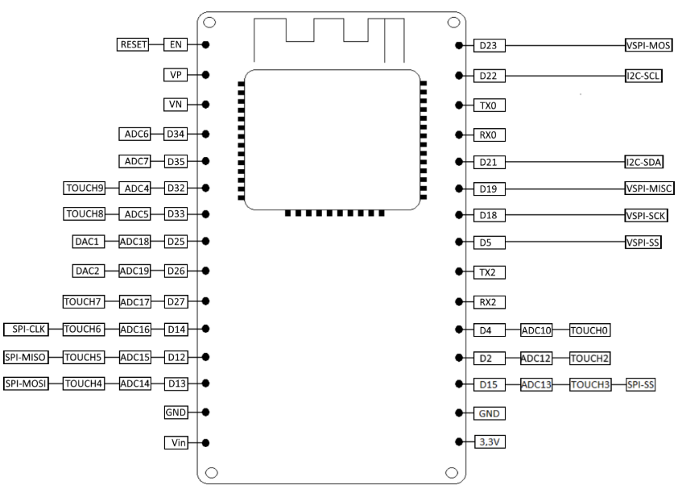
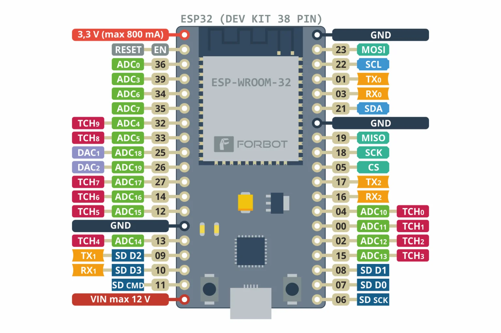

# Micro-contrôleur
Afin de correctement câbler les capteurs sur les cartes, voici les deux versions utilisées dans notre système. 

Nous utilisons en tout actuellement 4 cartes, et 2 types de capteurs différents, en ayant 2 capteurs par type, soit un total de 4 capteurs également.

Pour chaque capteur, nous avons utilisé une carte différente (versions A et B, voir ci-dessous), pour prouver que chaque carte peut interagir avec chaque capteur et peut être substituée.

## ESP32 Devkit-V1 (version A)
Voici une vue d'ensemble des PINs de la carte ESP32 (Devkit-V1) : 

## ESP32 générique (version B)
Voici une vue d'ensemble des PINs de la carte ESP32 (dite générique) :

# Capteur laser

## Dénomination
Waveshare Laser Sensor

## Câblage
Le capteur laser dispose de 3 câbles : VCC, GND et DOUT, correspondant à l'alimentation positive, la masse et à la sortie digitale (état du signal).
Sur le micro-contrôleur, les câbles d'alimentation iront sur les broches dédiées, normalement portant la même dénomination.
Pour la sortie digitale, il faudra le brancher sur le port D15 (ou P15 selon la carte).

# Capteur de spectre visible

## Dénomination
AS7341 Spectral Color Sensor

## Câblage
Le capteur laser dispose de 6 câbles : VCC, GND et SDA, SCL, GPIO et INT, correspondant à l'alimentation positive, la masse, la ligne de signal de donnée pour l'interface I2C, la ligne de signal de clock pour l'interface I2C, l'utilisation générale d'entrée/sortie, et enfin le signal d'interruption.
Nous n'utilisons ici que les 4 premiers ports mentionnés.

Sur le micro-contrôleur, les câbles d'alimentation iront sur les broches dédiées, normalement portant la même dénomination.
Pour la ligne de signal de donnée (SDA), il faudra la brancher sur le port D21 (ou P21 selon la carte). Pour la ligne de signal de clock (SCL), il faudra la brancher sur le port D22 (ou P22 selon la carte).
